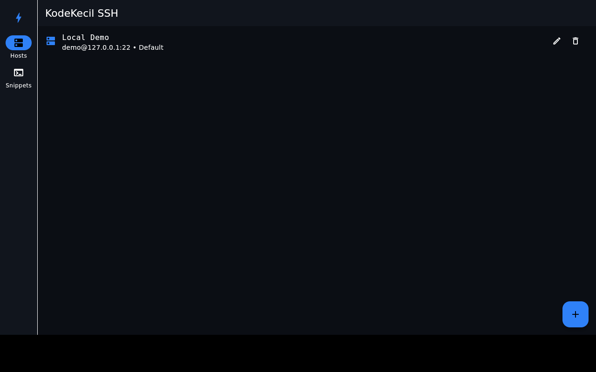
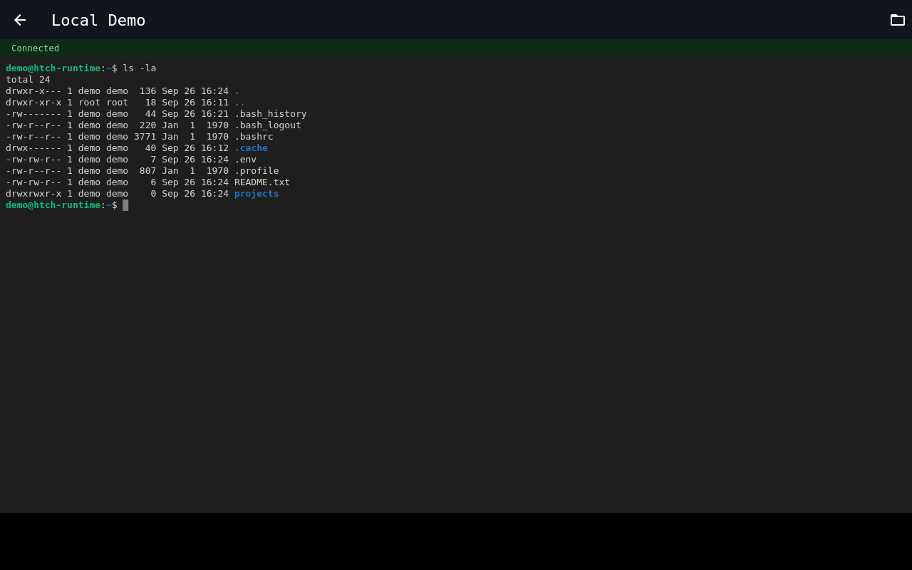
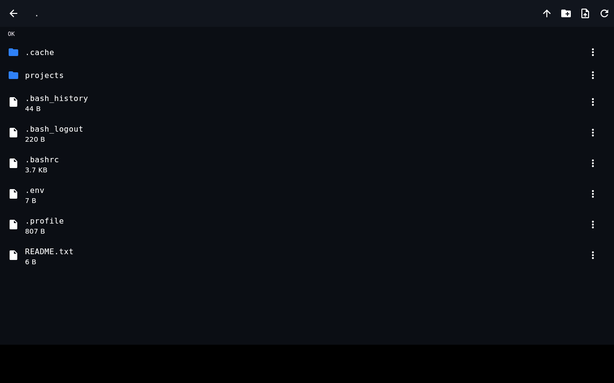

# KodeKecil SSH

[](https://github.com/vhmns14/kodekecil-ssh/actions/workflows/build.yml)
[](LICENSE)

Open-source SSH client for **Android** & **Linux**. Inspired by Termius — but free forever.

> Termius, but cheapest. (Indonesian pun: "termurah" = cheapest.)

## Screenshots

| Hosts | Terminal | SFTP |
|---|---|---|
|  |  |  |

## Principles

- **Local-first** — no account, no cloud, works fully offline.
- **Secure by default** — private keys & passwords live in the OS keyring (Android Keystore / Linux Secret Service), never in plaintext files. Zero telemetry.
- **Lightweight** — compiled native Flutter, not Electron. Runs comfortably on old hardware.
- **Open source (MIT)** — audit it, fork it, do whatever you want.

## Features

- [x] Host list with groups
- [x] SSH terminal (password & private-key auth)
- [x] SFTP browser: browse, upload, download (with progress), rename, delete, mkdir
- [x] Snippets: save and paste favorite commands
- [ ] Port forwarding (v0.2)
- [ ] Self-hosted sync between devices (v0.2)
- [ ] SSH agent forwarding (v0.3)

## Build

Requires Flutter SDK 3.47.5 (or newer).

```bash
flutter pub get
flutter analyze && flutter test

# Android
flutter build apk --release

# Linux
flutter build linux --release
```

> **Linux note:** secure storage uses libsecret. Install it first:
> `sudo dnf install libsecret-devel` (Fedora) or `sudo apt install libsecret-1-dev` (Debian/Ubuntu).

### RPM (Fedora)

```bash
flutter build linux --release
rpmbuild -bb packaging/rpm/kodekecil-ssh.spec \
  --define "_topdir $(pwd)/packaging/rpmbuild" \
  --define "_bundle $(pwd)/build/linux/x64/release/bundle"
```

Or grab the ready-made `.rpm` from [Releases](../../releases) (built automatically by GitHub Actions).

## Project structure

```
lib/
├── main.dart              # App shell (adaptive: sidebar on desktop, bottom nav on mobile)
├── models/                # Host, Snippet
├── services/
│   ├── ssh_service.dart   # SSH connections (dartssh2): shell + sftp
│   ├── secure_store.dart  # Private keys & passwords -> OS keyring
│   └── host_store.dart    # Host list (local JSON, no secrets)
└── screens/               # host_list, terminal, sftp, snippets
packaging/rpm/            # .spec file for Fedora
```

## Security

Report vulnerabilities via an issue with the `security` label. Never post private keys in issues. Seriously.

## License

MIT — see [LICENSE](LICENSE).
